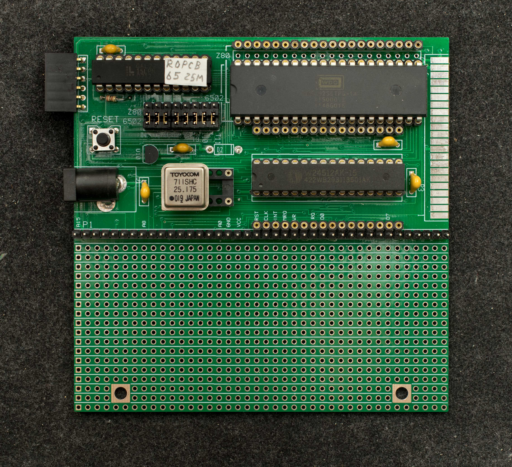
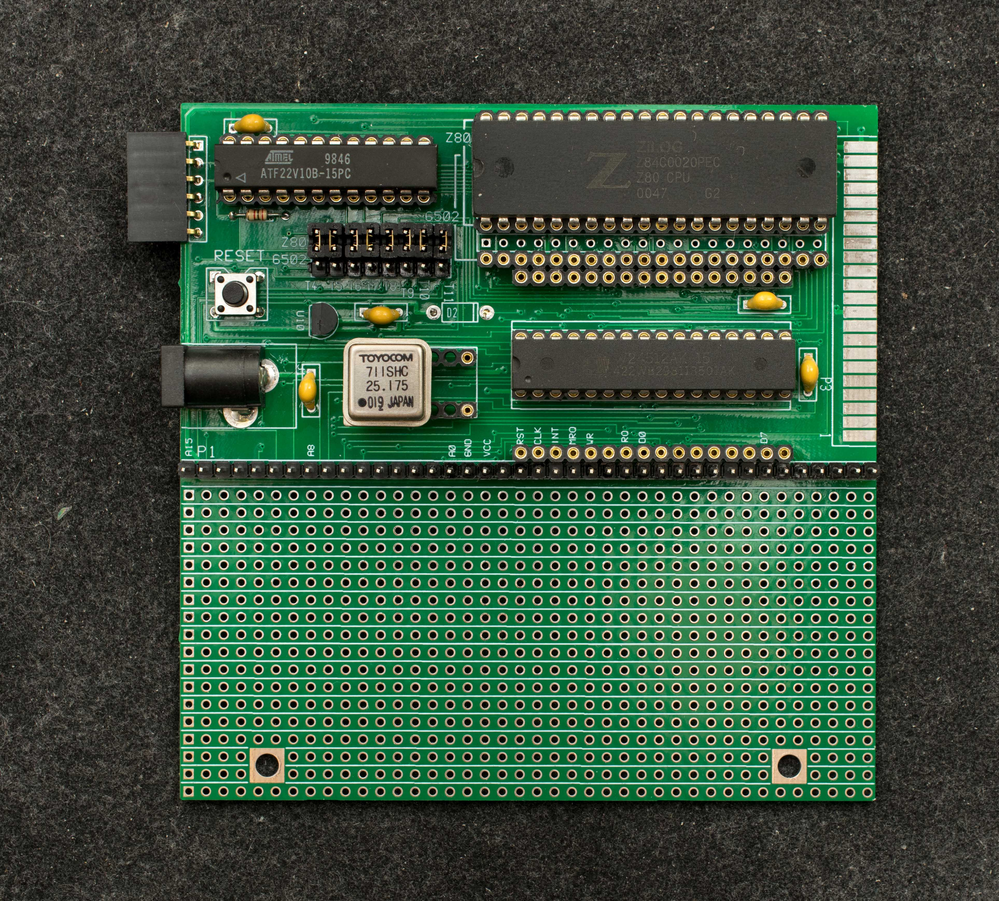
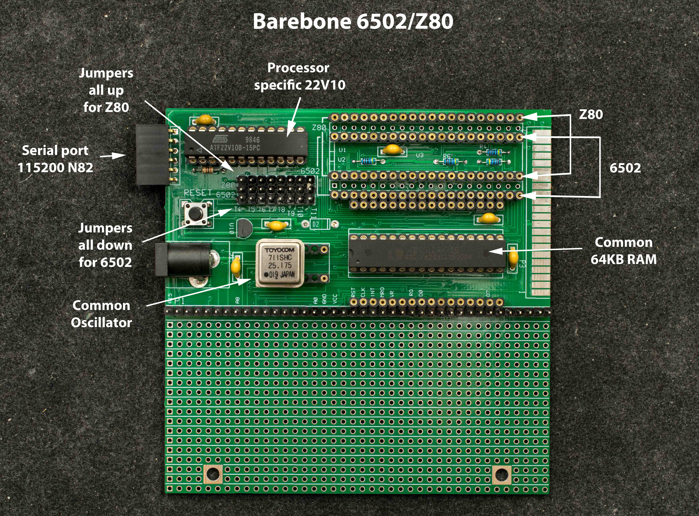
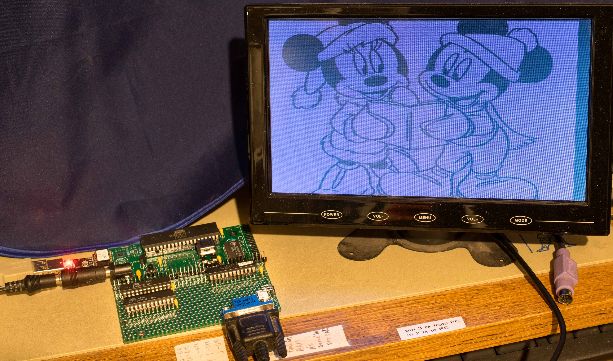
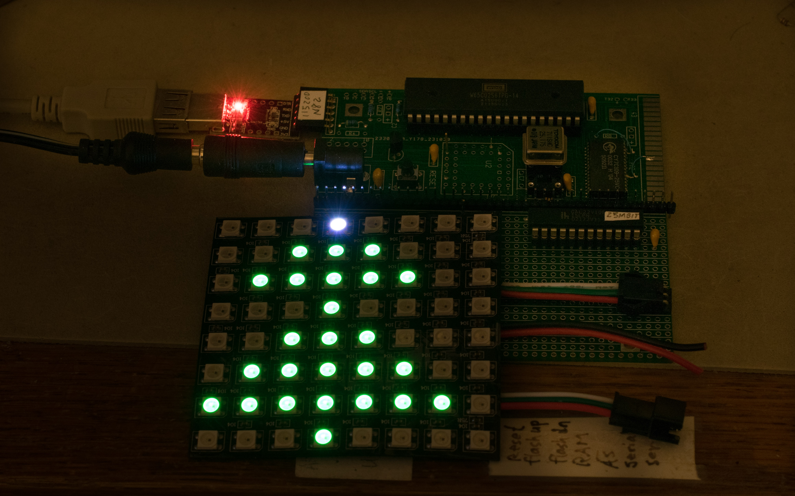
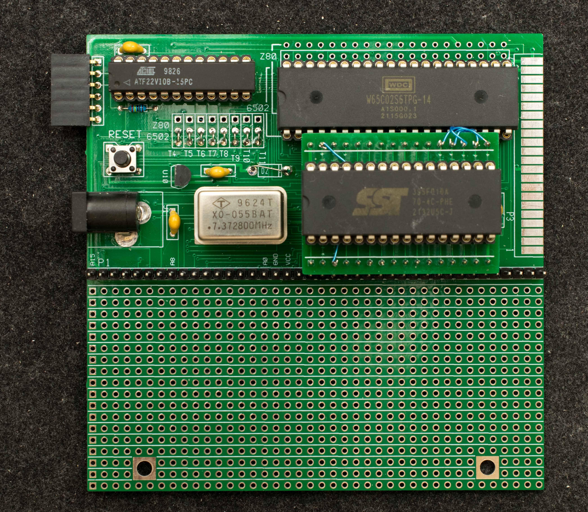
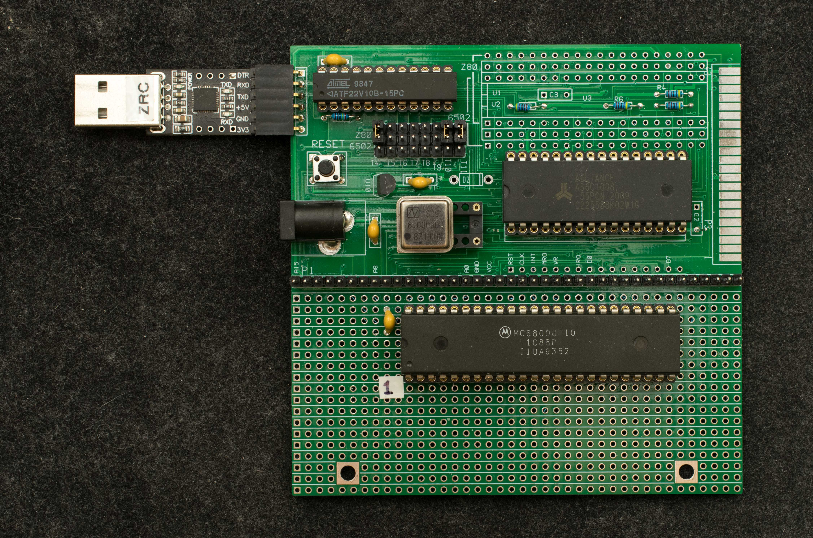

# Barebones 6502 or Z80 Computers
### Introduction
BB6580 is the combination of BB65 and BB80 plus an uncommitted 40-pin socket for another retro CPU. The board has common 22V10 SPLD and RAM but multiple sockets to host Z80, 6502, or another retro CPU.

Several online discussions of this topic are:

http://forum.6502.org/viewtopic.php?f=6&t=7856&hilit=22v10, Exploring a 6502 SBC using 22V10

http://forum.6502.org/viewtopic.php?f=6&t=7868, Muntz65, a barebone 6502 computer

https://groups.google.com/g/retro-comp/c/QWPGzS1glTQ/m/PBZSsUrgAgAJ, Muntz65 and Muntz80, two similarly minimal computers.

BB6580 populated with W65C02

BB6580 populated with Z80

### Features
- Z80 or 6502 at 25MHz
- 64K RAM
- GAL22V10 as bootstrap and serial port
- Bit-bang serial port, 15200 baud N82
- Uncommitted 40-pin DIP for third processor

### Theory of Operation
22V10 has 10 outputs; eight of them have large sum-of-product array with 10 to 16 product terms per output. The number of product terms are not the same with pins 17, 18 having 16 product terms while pin 15,22 having 10 product terms. By selectively assigning the most used data bits to output with largest product terms and least used data bits to outputs with smaller product terms, a decent size ROM can be created out of 22V10's logic array. The size of ROM is data dependent and data bit pin assignment. By trials and errors, 40-50 bytes of Z80 or 6502 program can be embedded in 22V10's logic array.

The 10 outputs of a 22V10 can be partition into 8 outputs for 40-50 bytes of ROM, and 2 outputs for RAM page register and register for serial transmitter. The RAM page register is cleared after reset so ROM occupies the entire memory space for read operations. However, RAM is still enabled and can accept data for write operations Another word, ROM is ready-only and RAM is write-only when RAM page register is cleared.

The serial port as implemented in 22V10 is a simple bit-bang serial transmitter and receiver. The serial receiver is a 2K resistor between serial receive terminal and Z80 or 6502's data bit 7; while the serial transmitter is a writable register either in Z80's I/O space or 6502's memory mapped register.

The ROM program in 22V10 is executed immediately after reset. It continuously samples data bit 7 (serial receive) for start bit; once start bit is detected, it waits 1-1/2 bit time to read in serial data and afterward sample serial data every bit time to a byte of data and write it into RAM. When specified number of data are received, the processor starts execution of newly received program.

### Design Information
- Schematic

- Gerber photoplots

- 22V10 Design Files
  - 22V10 for 25MHz Z80
  - 22V10 for 25MHz 6502
  - 22V10 for 7.37MHz 6502
- Bill of Materials

### Software
### Projects
[beam racing VGA](http://forum.6502.org/viewtopic.php?f=6&t=7868&hilit=bb6580&start=15#p105507) with 25MHz 6502 is described in three posts starting with this post:

[Driving NeoPixel](http://forum.6502.org/viewtopic.php?f=6&t=7868&hilit=bb6580&start=15#p105376) with 25MHz 6502 is described in this post:

BB6580 with 6502 and [modifications for an external ROM](https://www.retrobrewcomputers.org/doku.php?id=builderpages:plasmo:bb6580:bb6580r0home:bb65rom)

[BB6580 modified for 68008](https://www.retrobrewcomputers.org/doku.php?id=builderpages:plasmo:experimental68k:bb68008)

